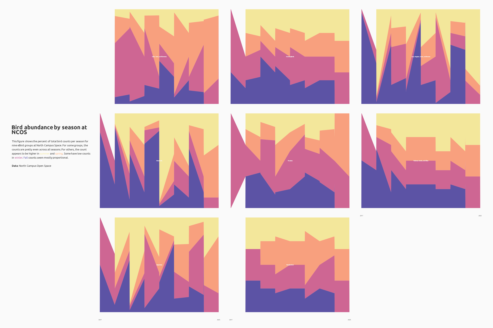

# Intermediate Elective Option 1

## General information

This repository contains data and code to visualize bird counts across seasons and time at North Campus Open Space.

To work with the code in this repository, you will need the following packages:

```
library(tidyverse)
library(here)
library(lubridate)
library(showtext)
library(camcorder)
library(ggtext)
library(glue)
library(tsibble)
library(rcartocolor)
library(paletteer)
```

## Data and file information

```
.
├── README.md
├── code                                          
│   ├── Wong-Kimberly_intermediate-elective.pdf   
│   └── Wong-Kimberly_intermediate-elective.qmd
├── data
│   └── birds-copy.csv
└── intermediate-elective.Rproj
```

## Rendered output

The rendered document for my intermediate elective is [here](https://github.com/kimwong19/intermediate-elective/blob/main/code/Wong-Kimberly_intermediate-elective.pdf). 

The final visualization is shown below: 



